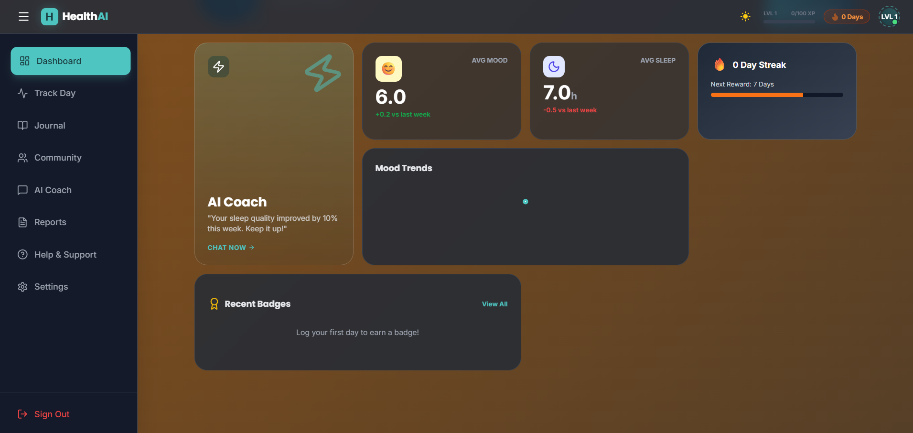
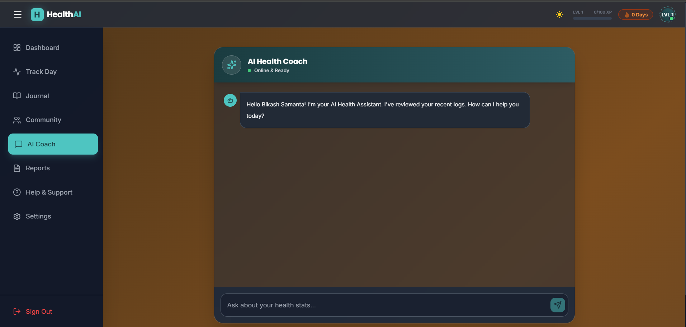

# 🥗 HealthAI - Your Personal AI Wellness Companion


*(Replace this link with an actual screenshot of your Dashboard)*

> **Revolutionizing health tracking with Generative AI.**
> Track your nutrition, mood, sleep, and fitness with the power of **Google Gemini 1.5 Flash**. Not just a logger, but an intelligent coach that understands you.


---

## 🚀 Key Features

### 🤖 AI-Powered Intelligence
- **📸 Food Vision AI:** Snap a photo of your meal, and the AI instantly estimates **calories, protein, carbs, and fats**.
- **🎙️ Voice Logging:** Just say *"I ate a burger and ran for 20 mins"*. The AI parses your voice and logs the data automatically.
- **💬 AI Health Coach:** A 24/7 chat assistant that knows your history and gives personalized medical advice (powered by Gemini).
- **🧠 Smart Journal:** Write your thoughts, and the AI analyzes your **Mood & Sentiment** to track mental well-being.

### 📊 Gamification & Tracking
- **🔥 Streaks & XP:** Earn XP for logging daily. Level up from "Novice" to "Health Guardian".
- **📉 Interactive Charts:** Visualize your weight, calories, and mood trends over time.
- **🏆 Leaderboard:** Compete with friends (Community features).

### 🛡️ Security & Utilities
- **🔐 Secure Auth:** Google Login (OAuth2) & Email/Password with verification.
- **📄 Clinical Reports:** Generate professional **PDF Health Reports** to share with your doctor.
- **🌙 Dark Mode:** Fully responsive UI with a beautiful dark theme.

---

## 🛠️ Tech Stack

| Domain | Technologies Used |
| :--- | :--- |
| **Frontend** | React.js (Vite), Tailwind CSS, Framer Motion, Lucide React, Recharts |
| **Backend** | Node.js, Express.js |
| **Database** | MongoDB (Mongoose) |
| **AI Engine** | Google Gemini 1.5 Flash API |
| **Real-time** | Socket.io (for AI Chat streaming) |
| **Authentication** | JWT, Google OAuth, Nodemailer (Email Verification) |

---

## 📸 Screenshots

| Dashboard | Food Vision AI |
| :---: | :---: |
|  |  |
| *Gamified stats & charts* | *Upload image & get macros* |

| AI Chat Coach | Dark Mode |
| :---: | :---: |
|  |  |
| *Context-aware advice* | *Easy on eyes at night* |

---

## ⚙️ Installation & Setup

Follow these steps to run the project locally.

### 1. Clone the Repository
```bash
git clone [https://github.com/your-username/health-ai-platform.git](https://github.com/your-username/health-ai-platform.git)
cd health-ai-platform

2. Backend Setup (Server)

cd server
npm install

Create a .env file in the server folder and add:

PORT=5000
MONGO_URI=your_mongodb_connection_string
JWT_SECRET=your_super_secret_key
GEMINI_API_KEY=your_google_gemini_api_key

# Email Config (Gmail App Password)
EMAIL_USER=your_email@gmail.com
EMAIL_PASS=your_app_password

# Google Auth
GOOGLE_CLIENT_ID=your_google_client_id

# Frontend URL (For CORS & Emails)
CLIENT_URL=http://localhost:5173
Run the server:Bashnpm run dev

3. Frontend Setup (Client)
Open a new terminal:

cd client
npm install

Create a .env file in the client folder and add:

VITE_API_URL=http://localhost:5000/api
VITE_SOCKET_URL=http://localhost:5000
VITE_GOOGLE_CLIENT_ID=your_google_client_id

Run the client:

npm run dev


🔗 API Endpoints

Method,Endpoint,Description
POST,/api/auth/signup,Register a new user
POST,/api/auth/google,Login with Google
POST,/api/ai/insight,Get AI health insights
POST,/api/ai/vision,Analyze food image
POST,/api/log/create,Create a daily health log
GET,/api/report/generate,Download PDF Report

🤝 Contributing

Contributions are welcome!

1. Fork the Project.
2.Create your Feature Branch (git checkout -b feature/AmazingFeature).3.Commit your Changes (git commit -m 'Add some AmazingFeature').
4.Push to the Branch (git push origin feature/AmazingFeature).
5.Open a Pull Request.

📞 Contact
Your Name 📧 Email: your.email@example.com
🔗 LinkedIn: linkedin.com/in/yourprofile
🐙 GitHub: github.com/yourusername⭐ 

Don't forget to star this repo if you found it useful!